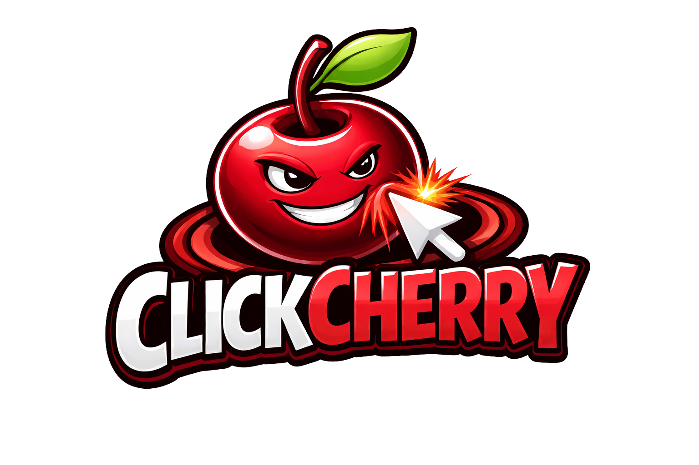
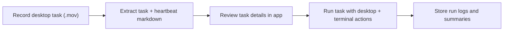

<p align="center">
  
</p>

<p align="center">
  <strong>Your desktop AI assistant that learns tasks from your screen recordings and runs them for you.</strong>
</p>

<p align="center">
  Teach once by recording your screen. Run it again with ClickCherry.
</p>

> ## Privacy First
> **Everything stays on your Mac by default.**
> **No personal task/workspace data is sent to ClickCherry servers.**
> **The only network calls are direct LLM API calls from your local app to OpenAI or Gemini using your own provider API keys.**
> **No ClickCherry relay server is in the middle.**

<p align="center">
  <a href="https://github.com/FarzamHejaziK/ClickCherry/actions/workflows/ci.yml"></a>
  <a href="https://github.com/FarzamHejaziK/ClickCherry/actions/workflows/release.yml"></a>
  
  
  <a href="LICENSE"></a>
</p>

<p align="center">
  <a href="docs/getting-started.md"><strong>Get Started</strong></a> ·
  <a href="docs/architecture.md"><strong>Architecture</strong></a> ·
  <a href="docs/release-process.md"><strong>Release Process</strong></a>
</p>

## Why ClickCherry

ClickCherry is built for people who repeatedly do desktop tasks and want a fast way to capture those workflows, structure them, and run them again.

- Native macOS app (SwiftUI)
- Local-first task workspace files
- Recording-first flow (`New Task` -> capture -> extract)
- LLM-backed extraction and execution
- Signed + notarized release pipeline

## Privacy

ClickCherry is designed as a local-first desktop app:

- Task files, recordings, heartbeats, run logs, and local state stay on your machine.
- ClickCherry does not upload your personal workspace data to ClickCherry-operated servers.
- LLM requests are made directly from your local app to OpenAI or Gemini using your own API keys.
- No ClickCherry server proxies or relays those LLM requests.
- Your keys are stored in macOS Keychain.

## Product Flow



## Quickstart

### 1. Clone

```bash
git clone https://github.com/FarzamHejaziK/ClickCherry.git
cd ClickCherry
```

### 2. Build

```bash
xcodebuild -project TaskAgentMacOSApp/TaskAgentMacOSApp.xcodeproj \
  -scheme TaskAgentMacOSApp \
  -destination "platform=macOS" \
  -derivedDataPath /tmp/taskagent-dd-local \
  CODE_SIGNING_ALLOWED=NO build
```

### 3. Run Tests

```bash
xcodebuild -project TaskAgentMacOSApp/TaskAgentMacOSApp.xcodeproj \
  -scheme TaskAgentMacOSApp \
  -destination "platform=macOS,arch=arm64" \
  -derivedDataPath /tmp/taskagent-dd-local-tests \
  -parallel-testing-enabled NO \
  -only-testing:TaskAgentMacOSAppTests \
  CODE_SIGNING_ALLOWED=NO test
```

## Documentation

| Guide | Purpose |
|---|---|
| [`docs/getting-started.md`](docs/getting-started.md) | Install, build, test, and first contribution |
| [`docs/development.md`](docs/development.md) | Repo structure, prompts, tests, PR expectations |
| [`docs/architecture.md`](docs/architecture.md) | Core app modules and runtime data flow |
| [`docs/release-process.md`](docs/release-process.md) | Tagging, release workflow, signing, notarization |
| [`docs/README.md`](docs/README.md) | Documentation index |

## Open Source Baseline

- License: MIT ([`LICENSE`](LICENSE))
- Contributions: [`CONTRIBUTING.md`](CONTRIBUTING.md)
- DCO required: `git commit -s`
- Code of Conduct: [`CODE_OF_CONDUCT.md`](CODE_OF_CONDUCT.md)
- Security policy: [`SECURITY.md`](SECURITY.md)
- Governance: [`GOVERNANCE.md`](GOVERNANCE.md), [`MAINTAINERS.md`](MAINTAINERS.md)
- Trademark/brand usage: [`TRADEMARK.md`](TRADEMARK.md)

## Project Layout

- `TaskAgentMacOSApp/` - app code, tests, Xcode project
- `docs/` - public contributor and operator docs
- `.github/` - CI/release workflows and repo automation
- `.docs/` - internal maintainer planning and execution logs
