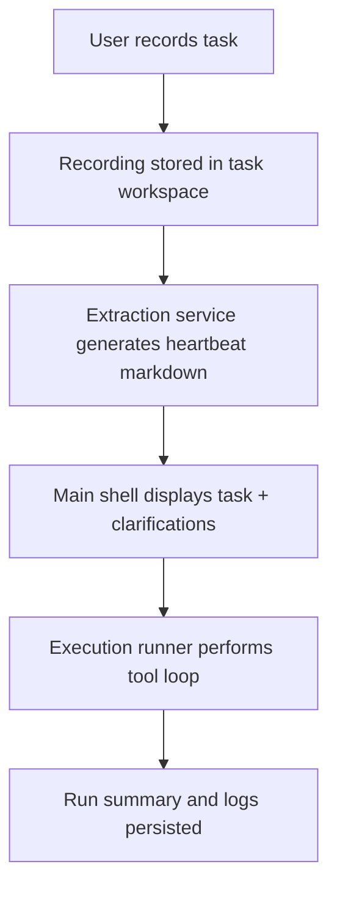

# Architecture Overview

ClickCherry is a native SwiftUI macOS app with local-first task workspaces and LLM-backed extraction/execution.

## Core Modules

- Task/workspace persistence services
- Recording capture and recording metadata handling
- Task extraction pipeline from recorded media
- Execution engine (desktop + terminal action loop)
- Onboarding/provider configuration and key storage

## Runtime Flow

## Design Principles

- Local-first task data and artifacts
- Explicit macOS permission preflight
- Testable service boundaries
- Prompt text loaded from file-based prompt catalog
